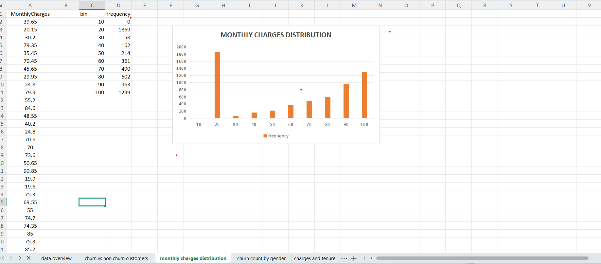
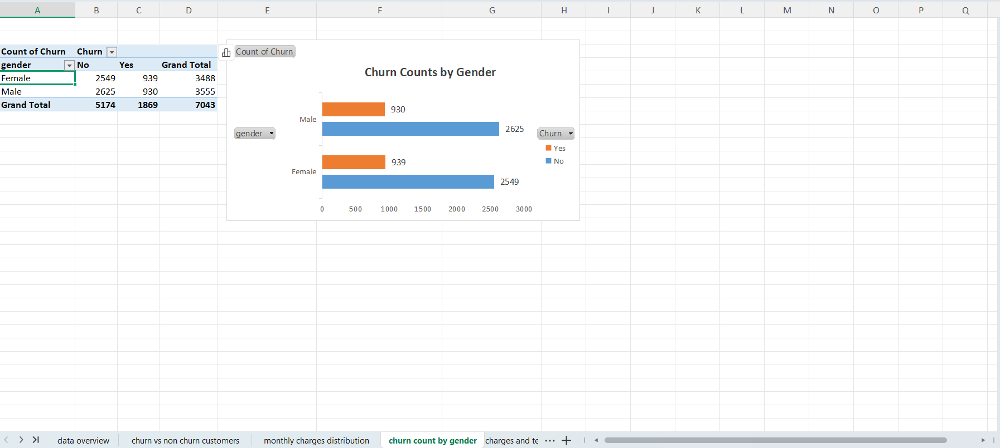
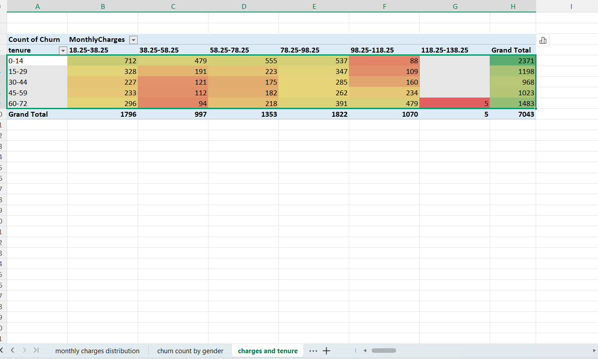

# Telco Customer Churn - Data Visualization & Analysis

## Project Overview
This repository contains a comprehensive data analysis and visualization project focused on a Telecommunications Customer Churn dataset. The objective of this project was to analyze customer metrics—specifically monthly charges, gender distributions, and tenure—to identify key patterns behind customer churn behavior.

---

## Project Tasks & Implementations

### Task 1 & 2: Data Threshold Analysis
* **Description:** Conducted an initial overview of the dataset and implemented conditional counting to filter specific pricing tiers.
* **Formula Used:** `=COUNTIF(A:A, ">10")` to isolate and count accounts exceeding the baseline monthly charge threshold.

### Task 3: Monthly Charges Distribution
* **Description:** Created a manual frequency distribution table to group continuous pricing metrics into clean intervals (bins of 10) ranging from 10 to 100. 
* **Visualization:** Generated a Clustered Column Chart acting as a true distribution histogram to analyze where the majority of customer billing sits.

### Task 4: Churn Rates by Gender
* **Description:** Built a dynamic Pivot Table to cross-tabulate customer gender metrics against explicit churn indicators ("Yes" vs. "No").
* **Visualization:** Developed a custom-colored Clustered Bar Chart to provide a side-by-side behavioral comparison between male and female customer retention profiles.

### Task 5: Heatmap for Monthly Charges and Tenure Interaction
* **Description:** Modeled a high-level cross-tabulation matrix utilizing a Pivot Table to observe how customer tenure ranges interact with shifting monthly charge brackets.
* **Visualization:** Applied conditional formatting color scales to output an executive-ready interaction Heatmap, visually identifying high-density volume zones while maintaining strict data integrity profiles by filtering unclassified system anomalies.

---

## Technologies & Tools Used
* **Software:** WPS Office / Microsoft Excel
* **Core Techniques:** Pivot Tables, Advanced Logical Formulas (`COUNTIF`, `COUNTIFS`), Conditional Formatting, Data Binning, and Statistical Chart Customization.

---

## How to Review the Project
1. Clone or download this repository.
2. Open the `TELCO_customer_churn_analysis.xlsx` file in Microsoft Excel or WPS Office.
3. Navigate across the labeled tabs to explore the calculations, pivot models, and interactive charts.
