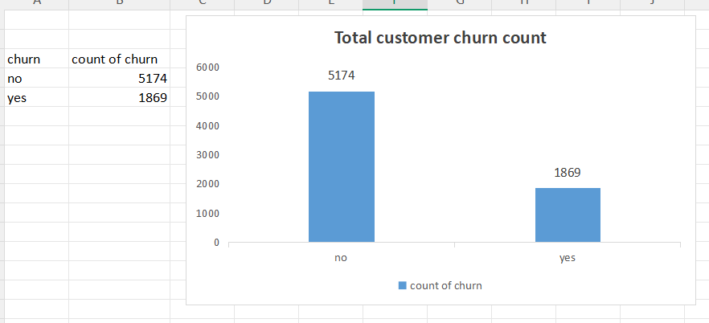

# Telco Customer Churn - Data Visualization & Analysis

## Project Overview
This repository contains a comprehensive data analysis and visualization project focused on a Telecommunications Customer Churn dataset. The objective of this project was to analyze customer metrics—specifically monthly charges, gender distributions, and tenure—to identify key patterns behind customer churn behavior.

---

## Project Tasks & Implementations

### Task 1: Data Overview and Simple Sorting
* **Description:** Conducted an initial overview of the dataset to understand its column structure, data types, and integrity. Sorted the data by tenure to easily inspect customers with the shortest and longest relationships with the provider.
* **Data Cleaning:** Filtered the core dataset to isolate and display only the customer profiles who have actively churned.

### Task 2: Churn Count Visualization
* **Description:** Developed a focused breakdown to compare the volume of active customers against those who have discontinued services.
* **Analytical Insight:** Out of 7,043 total customers, 1,869 have churned while 5,174 were retained. This represents a **26.5% churn rate**, meaning roughly 1 in 4 customers are leaving the company.
* **Visualization:** Implemented an optimized Pivot Table to aggregate the metrics and rendered a 2D Clustered Column Chart with explicit data labels to make the numbers immediately scannable.

### Task 3: Monthly Charges Distribution
* **Description:** Created a manual frequency distribution table to group continuous pricing metrics into clean intervals (bins of 10) ranging from 10 to 100.
* **Visualization:** Generated a Clustered Column Chart acting as a true distribution histogram to analyze where the majority of customer billing sits.

### Task 4: Churn Rates by Gender
* **Description:** Built a dynamic Pivot Table to cross-tabulate customer gender metrics against explicit churn indicators ("Yes" vs. "No").
* **Visualization:** Developed a custom-colored Clustered Bar Chart to provide a side-by-side behavioral comparison between male and female customer retention profiles.

### Task 5: Interaction Heatmap (Tenure vs. Monthly Charges)
* **Description:** Constructed an advanced interaction matrix correlating customer loyalty lifecycles (Tenure ranges) against financial billing tiers.
* **Visualization:** Leveraged Excel conditional formatting to build a color-coded heatmap grid, instantly flagging high-density critical risk segments where high-paying accounts churn early.

---

## Skills Enhanced
* Advanced Data Sorting & Filtering
* Pivot Table Matrix Generation
* Data Visualization & Descriptive Chart Design (Histograms, Bar Charts, Column Charts)
* Conditional Formatting Matrix (Heatmap construction)
* Quantitative Business Intelligence & Churn Analysis

---
*Completed as part of the Business Analysis Assignment at **SaiKet Systems**.*
